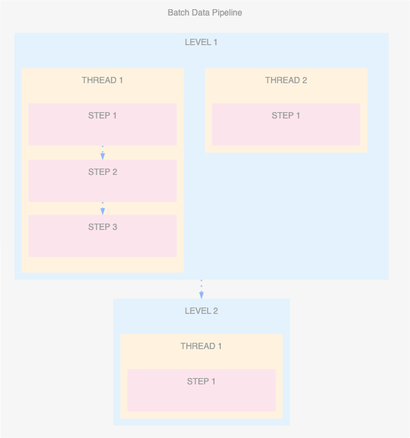

# Analytics Engineering Framework - Data Orchestration

This repository automates the creation of [Google Cloud Workflows Definition](https://cloud.google.com/workflows/docs/reference/syntax) files from data pipeline configuration files. 
It's designed for seamless integration into your CI/CD pipeline, using ***LEVEL***, ***THREAD***, and ***STEP*** abstractions to define your batch data pipeline. 
You also have the flexibility to directly execute ***workflows_generator.py*** for manual workflow definition generation.

## Key Features
- ***CI/CD Integration:***  Effortlessly streamline your Google Cloud Workflow generation within your CI/CD pipeline.
- ***Abstracted Pipeline Definition:*** Conveniently define your batch data pipelines using the intuitive concepts of LEVEL, THREAD, and STEP.
- ***Manual Execution:*** Option to directly run ***workflows_generator.py*** for on-demand workflow creation.

##  Concepts
Most batch data pipelines can be effectively defined using three simple concepts, simplifying  pipeline creation and scheduling for data analysts:
- ***LEVEL:*** The largest aggregation within your pipeline. Levels execute sequentially, and you can have as many as needed. Identify each LEVEL with a unique ID.
- ***STEP:*** The atomic unit of execution. A STEP represents a data transformation process (e.g., Dataflow job, BigQuery job, Dataproc job).
- ***THREAD:*** Allows for complex dependencies and parallel execution within your pipeline. A THREAD groups steps that execute sequentially.  A LEVEL can have multiple THREADs running in parallel.



This approach enables data analysts to build intricate data pipelines and reliably orchestrate them without writing  code. Configuration is handled through simple JSON definition files containing levels, threads, and steps.

### 1. CI/CD Pipeline Integration
- Include this repository as a step in your CI/CD pipeline.
- Configure the pipeline to provide the necessary data pipeline configuration files.
- The CI/CD pipeline should automatically execute ***workflows_generator.py***, generate the Workflow Definitions and crete those in the Google Cloud Platform.

### 2. Manual Execution
```
python3 workflows_generator.py \
../workflows-definition/etl_example_1.json \
../workflows-definition/platform-parameters-dev.json \
workflows_etl_example_1.json \
False
```